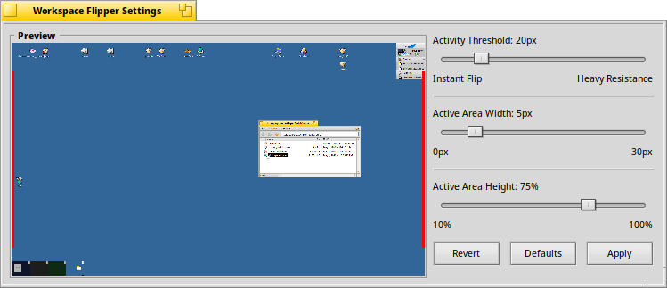

## Workspace Flipper

Workspace Flipper is a small input_server AddOn/Filter for the Haiku operating system.  It allows changing the active workspace by moving the mouse cursor up against the edge of the screen.  _You should not install this AddOn if you use Haiku in a VM with 'absolute pointer' enabled._

------------------------------------------------------------





### Build Instructions

```
cmake .
make
make install
```
You may need to reboot after installing in order to restart the input_server process.
